<div align="center">


<br/>

<a href="https://github.com/Sumit200531"></a>



</div>

<br/>


<div align="center">
</div>

<br/>


```java
class Sumit implements Learner, Builder {

    String   education = "B.Tech, Computer Science Engineering";
    String[] focus      = {"Full Stack", "Backend & Systems", "AI / LLM / RAG"};
    String[] alsoLoves  = {"DSA", "shipping side projects that actually run"};
    String   looking    = "Software Engineering internship";

    void dailyRoutine() {
        while (true) { learn(); build(); debug(); ship(); repeat(); }
    }
}
```

> I write code, break it in ways I didn't think were possible, fix it, and immediately go looking for the next way to break it. Most days that means backend work and full-stack builds. Lately it's meant poking at how LLMs, embeddings and RAG actually fit together.

<details>
<summary><b>🐛 known bugs (in me, not the code)</b></summary>
<br/>

```diff
Known Bugs:  [████████████████████] 100% reproducible

- Sleeps less than recommended
- Opens 40 tabs, closes 2
- Starts a project faster than finishing the last one
- Says "I'll refactor it later"
- Later has not yet arrived
```

</details>

<br/>



<br/>


<div align="center">

| layer | tools |
|:---:|:---:|
| **languages** |  |
| **frontend** |  |
| **backend** |  |
| **data** |  |
| **tools** |  |
| **ai / llm** |     |

</div>

<br/>


<div align="center">
</div>

<details>
<summary><b>⚙️ what's inside each build</b></summary>
<br/>

**🗂️ Task Management App**: REST APIs built with Express.js · user authentication · MongoDB persistence · React-powered UI

**💾 Multithreaded C++ Backup System**: directory scanning with `std::filesystem` · timestamp-based backups · backup logging · multithreaded processing for concurrency

**🎵 Voice-Based Song Recommender**: speech processing with SpeechBrain · voice-driven recommendations · web interface in HTML & CSS

<sub>repo links land here once the repos go public.</sub>

</details>

<br/>



<br/>



> **a few things I hold onto while building**
>
> ◆ Working code beats clever code that no one, including future me, can read.<br/>
> ◆ If I can't explain why it broke, I don't actually understand it yet.<br/>
> ◆ Ship the small version. The big version is just several small versions in a trench coat.<br/>
> ◆ Every bug is a free lesson I didn't ask for but am taking anyway.

<details>
<summary><b>💻 developer.exe</b></summary>
<br/>

```
☑ Wrote code
☑ Broke code
☑ Googled the exact error message
☑ Found a 6-year-old Stack Overflow answer
☑ Asked AI anyway
☑ Fixed it
☑ Have no idea why it works now
☑ Committed before it stops working
```

</details>

<br/>



<br/>


<div align="center">


</div>

<br/>


<div align="center">

`Java` · `Spring Boot` · `Node.js` · `React` · `MongoDB` · `DSA` · `Docker` · `LLM / RAG`

**Open to SWE internships, open-source contributions, and building AI/backend things together.**

<a href="https://github.com/Sumit200531"></a>
<a href="https://www.linkedin.com/in/sumit-goswami-123"></a>
<a href="mailto:yourrealemail@gmail.com"></a>

<br/><br/>


</div>
