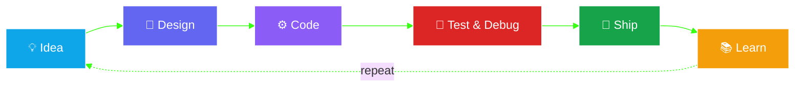

<!--
  ✏️ BEFORE YOU COMMIT, REPLACE THESE PLACEHOLDERS:
  1. YOUR-REPO-NAME        -> your project repo names (3 places)
  2. YOUR-LINKEDIN-ID      -> your LinkedIn username
  3. YOUR-EMAIL@gmail.com  -> your email
-->

<!-- ===================== HERO ===================== -->
<div align="center">


<a href="https://github.com/Sumit200531">
  
</a>

<br/>


</div>


<!-- ===================== TERMINAL ===================== -->
<div align="center">
  
</div>


## 👨‍💻 About Me

```java
public class Sumit extends SoftwareEngineer implements Learner, Builder {

    String education   = "B.Tech in Computer Science Engineering";
    String[] mainFocus = {"Full Stack Development", "Backend & System Development", "AI / LLM / RAG"};
    String[] loves     = {"Solving DSA", "Building real-world projects"};
    String status      = "Actively looking for a SWE internship 🚀";

    @Override
    public void dailyRoutine() {
        while (alive) {
            learn();
            build();
            debug();
            repeat();
        }
    }
}
```


## 🛠️ Tech Arsenal

<div align="center">

#### 🧠 Languages


#### 🎨 Frontend


#### ⚙️ Backend


#### 🗄️ Databases & Tools


#### 🤖 AI / ML

<br/>


</div>


## 🚀 Featured Projects

<table>
  <tr>
    <td width="33%" valign="top">
      <h3>🗂️ Task Management App</h3>
      <p>A full-stack web app to manage tasks efficiently through a modern interface.</p>
      <p>
        
        
        
        
      </p>
      <details>
        <summary>⚙️ <b>What's inside</b></summary>
        <ul>
          <li>REST APIs built with Express.js</li>
          <li>User authentication</li>
          <li>MongoDB data persistence</li>
          <li>React-powered UI</li>
        </ul>
      </details>
      <a href="https://github.com/Sumit200531/YOUR-REPO-NAME">🔗 <b>View Project</b></a>
    </td>
    <td width="33%" valign="top">
      <h3>💾 Multithreaded C++ Backup System</h3>
      <p>A lightweight backup tool that scans directories, creates timestamped backups and keeps logs.</p>
      <p>
        
        
        
      </p>
      <details>
        <summary>⚙️ <b>What's inside</b></summary>
        <ul>
          <li>Directory scanning with <code>std::filesystem</code></li>
          <li>Timestamp-based backups</li>
          <li>Backup logging</li>
          <li>Multithreaded processing for concurrency</li>
        </ul>
      </details>
      <a href="https://github.com/Sumit200531/YOUR-REPO-NAME">🔗 <b>View Project</b></a>
    </td>
    <td width="33%" valign="top">
      <h3>🎵 Voice-Based Song Recommender</h3>
      <p>A voice-driven app that listens to your speech and recommends songs based on it.</p>
      <p>
        
        
        
      </p>
      <details>
        <summary>⚙️ <b>What's inside</b></summary>
        <ul>
          <li>Speech processing with SpeechBrain</li>
          <li>Song recommendations from voice input</li>
          <li>Web interface in HTML &amp; CSS</li>
        </ul>
      </details>
      <a href="https://github.com/Sumit200531/YOUR-REPO-NAME">🔗 <b>View Project</b></a>
    </td>
  </tr>
</table>


## 🤖 My AI / LLM Roadmap

```mermaid
%%{init: {'theme': 'base', 'themeVariables': {'lineColor': '#00f7ff', 'fontFamily': 'monospace'}}}%%
flowchart LR
    A(["🧠 LLM Applications"]):::c1 --> B(["✍️ Prompt Engineering"]):::c2
    B --> C(["🔢 Embeddings"]):::c3
    C --> D(["🗄️ Vector Databases"]):::c4
    D --> E(["🔎 RAG Pipelines"]):::c5
    E --> F(["🚀 AI-Powered Apps"]):::c6

    classDef c1 fill:#0ea5e9,stroke:#ffffff,color:#ffffff;
    classDef c2 fill:#6366f1,stroke:#ffffff,color:#ffffff;
    classDef c3 fill:#8b5cf6,stroke:#ffffff,color:#ffffff;
    classDef c4 fill:#d946ef,stroke:#ffffff,color:#ffffff;
    classDef c5 fill:#f97316,stroke:#ffffff,color:#ffffff;
    classDef c6 fill:#16a34a,stroke:#ffffff,color:#ffffff;
```



## 🔁 How I Build Things




## 📊 Live GitHub Stats

<div align="center">
  
  
</div>

<div align="center">
  
</div>

<div align="center">
  
</div>


## 🧠 Currently Learning

<div align="center">
  
  <br/><br/>
  
  
  
  
  
  <br/>
  
  
  
  
</div>

## 🎯 2026 Mission Board

- [ ] 🚀 Build production-ready applications
- [ ] 💼 Land a Software Engineering internship
- [ ] 🧠 Strengthen DSA & problem solving
- [ ] ☕ Level up Java & Spring Boot
- [ ] 🤖 Build practical LLM / RAG applications
- [ ] 🐳 Improve Docker & backend deployment
- [ ] 🌱 Contribute to open source


## 💬 Random Dev Wisdom

<div align="center">
  
  <br/>
  
</div>

## 🤝 Let's Collaborate

<details open>
  <summary><b>💡 Ask me about</b></summary>
  <br/>
  Java • Spring Boot • Node.js • React • MongoDB • DSA • Docker • LLM / RAG applications
</details>

<details open>
  <summary><b>🌱 I'm open to</b></summary>
  <br/>
  Software Engineering internships • Open-source contributions • Building AI &amp; backend projects together
</details>


## 📫 Connect With Me

<div align="center">

<a href="https://github.com/Sumit200531">
  
</a>
<a href="https://www.linkedin.com/in/YOUR-LINKEDIN-ID">
  
</a>
<a href="mailto:YOUR-EMAIL@gmail.com">
  
</a>

<br/><br/>


</div>
