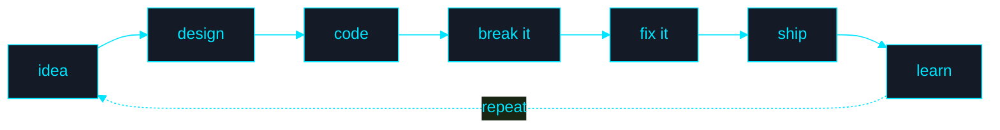

<div align="center">


<p align="center">
  
</p>

<sub><i>status: probably fixing a bug I created 10 minutes ago</i></sub>


<a href="https://github.com/Sumit200531"></a>


</div>


<br/>

<table width="100%">
<tr>
<td width="55%" valign="top">

```
$ whoami
> Sumit — B.Tech CSE, hunting a SWE internship

$ stack --focus
> full-stack · backend/systems · AI · LLM/RAG

$ uptime --coffee
> still standing, barely

$ status
> [██████████████░░░░] 78% — debugging in progress
```

</td>
<td width="45%" valign="top" align="center">


</td>
</tr>
</table>


<br/>

<div align="center">

</div>

<div align="center">

| | |
|---|---|
| 🎓 | B.Tech CSE — actively looking for a **Software Engineering internship** |
| 🧩 | Comfortable across **full-stack + backend**: Java/Spring Boot, Node/Express, React, MongoDB/MySQL |
| 🤖 | Building hands-on with **LLMs / RAG / embeddings / vector DBs** — not just reading about them |
| 🐳 | Ships things with **Docker**, writes tests, actually reads the error message before Googling it (mostly) |
| ⏱️ | Available: internships, part-time, open-source collabs — reach out below |

</div>

<br/>

<div align="center">

</div>

<table width="100%">
<tr>
<td width="70%" valign="top">

```java
class Sumit implements Learner, Builder {

    String   education = "B.Tech, Computer Science Engineering";
    String[] focus      = {"Full Stack", "Backend & Systems", "AI / LLM / RAG"};
    String[] alsoLoves  = {"DSA", "shipping side projects that actually run"};
    String   looking    = "Software Engineering internship";

    void dailyRoutine() {
        while (true) { learn(); build(); debug(); ship(); repeat(); }
    }
}
```

I write code, break it in ways I didn't think were possible, fix it, and immediately go looking for the next way to break it. Most days that means backend work and full-stack builds — lately it's meant poking at how LLMs, embeddings and RAG actually fit together.

</td>
<td width="30%" valign="top" align="center">


</td>
</tr>
</table>

<br/>

<div align="center">

</div>

<div align="center">

| | |
|---|---|
| 🚀 | Production-ready applications, not just tutorials |
| 💼 | A Software Engineering internship |
| 🧠 | Sharper DSA & problem-solving |
| ☕ | Real fluency in Java & Spring Boot |
| 🤖 | LLM / RAG applications that do something useful |
| 🐳 | Comfort with Docker & backend deployment |
| 🌱 | An actual open-source contribution |

</div>

<br/>

<div align="center">

</div>

<div align="center">

**Languages**
<br/>


**Frontend**
<br/>


**Backend**
<br/>


**Data**
<br/>


**Tools**
<br/>


**AI / LLM**
<br/>


</div>

<br/>

<div align="center">

</div>

<table width="100%">
<tr>
<td width="33%" valign="top">

**🗂️ Task Management App**
<br/>
Full-stack task manager with REST APIs, auth, and a React front end talking to a Mongo-backed Express server.
<br/><br/>
   
<br/><br/>
<details>
<summary>⚙️ what's inside</summary>
<br/>

- REST APIs built with Express.js
- User authentication
- MongoDB persistence
- React-powered UI

</details>

</td>
<td width="33%" valign="top">

**💾 Multithreaded C++ Backup System**
<br/>
CLI backup tool: scans directories, takes timestamped snapshots, and processes them concurrently instead of one file at a time.
<br/><br/>
  
<br/><br/>
<details>
<summary>⚙️ what's inside</summary>
<br/>

- Directory scanning with `std::filesystem`
- Timestamp-based backups
- Backup logging
- Multithreaded processing for concurrency

</details>

</td>
<td width="33%" valign="top">

**🎵 Voice-Based Song Recommender**
<br/>
Listens to speech input and recommends songs based on it — speech processing meets recommendation, wrapped in a simple web UI.
<br/><br/>
  
<br/><br/>
<details>
<summary>⚙️ what's inside</summary>
<br/>

- Speech processing with SpeechBrain
- Voice-driven song recommendations
- Web interface in HTML & CSS

</details>

</td>
</tr>
</table>

<sub>repo links go here once the repos are public — send them over and I'll drop them in</sub>

<br/>

<div align="center">

</div>

<div align="center">

```
┌─────────────────────────────────────────┐
│  currently poking at                     │
├─────────────────────────────────────────┤
│  LLMs · RAG pipelines · embeddings       │
│  vector databases · AI-powered apps      │
└─────────────────────────────────────────┘
```

</div>

Not claiming mastery here — this is the "actively taking it apart to see how it works" stage, logged in public so future-me (and anyone hiring) can see the trajectory.

<br/>

<div align="center">

</div>



**a few things I hold onto while building:**
- Working code beats clever code that no one — including future me — can read.
- If I can't explain why it broke, I don't actually understand it yet.
- Ship the small version. The big version is just several small versions in a trench coat.
- Every bug is a free lesson I didn't ask for but am taking anyway.

<br/>

<p align="center">
  
</p>

<div align="center"><sub><i>me, explaining to the interviewer why the demo worked five minutes ago</i></sub></div>

<br/>

<div align="center">

</div>

```
NOW
 │
 ├── Java & Spring Boot
 │
 ├── Node.js & backend architecture
 │
 ├── LLMs + RAG
 │
 ├── System design
 │
 └── AI-native software engineering (eventually)
```

<br/>

<details>
<summary><b>🐛 known bugs (in me, not the code)</b></summary>
<br/>

```
Known Bugs:
[████████████████████] 100% reproducible

- Sleeps less than recommended
- Opens 40 tabs, closes 2
- Starts a project faster than finishing the last one
- Says "I'll refactor it later"
- Later has not yet arrived
```

</details>

<details>
<summary><b>💻 developer.exe</b></summary>
<br/>

```
☑ Wrote code
☑ Broke code
☑ Googled the exact error message
☑ Found a 6-year-old Stack Overflow answer
☑ Asked AI anyway
☑ Fixed it
☑ Have no idea why it works now
☑ Committed before it stops working
```

</details>

<br/>

<div align="center">

</div>

<div align="center">


<br/>


<br/>


<br/><br/>


</div>

<sub>the snake animation renders once the workflow below runs on your repo — see the setup note.</sub>

<details>
<summary>⚙️ one-time setup for the animated snake graph</summary>
<br/>

1. In your `Sumit200531/Sumit200531` repo, create `.github/workflows/snake.yml` with the workflow provided alongside this README.
2. Push it to `main` — it runs on push and once a day after that, and publishes an SVG to an `output` branch.
3. The `` tag above already points at that branch, so once it's run once, the snake shows up automatically.

</details>

<br/>

<div align="center">

</div>

<div align="center">

`Java` `Spring Boot` `Node.js` `React` `MongoDB` `DSA` `Docker` `LLM / RAG`

I'm open to SWE internships, open-source contributions, and building AI/backend things together.

</div>

<br/>

<div align="center">

<a href="https://github.com/Sumit200531"></a>
<a href="https://www.linkedin.com/in/YOUR-LINKEDIN-ID"></a>
<a href="mailto:YOUR-EMAIL@gmail.com"></a>

<br/><br/>


<br/><br/>


</div>
