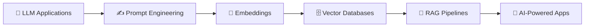

<!-- ===================== HEADER ===================== -->
<div align="center">


<a href="https://github.com/Sumit200531">
  
</a>

<br/>


</div>

---

## 👨‍💻 About Me

```js
const sumit = {
  role: "Aspiring Software Engineer",
  education: "B.Tech in Computer Science Engineering",
  focus: ["Full Stack Development", "Backend & System Development", "AI / LLM / RAG"],
  loves: ["Solving DSA", "Building real-world projects"],
  currentlyLearning: ["Spring Boot", "Docker", "RAG Pipelines", "System Design"],
  lookingFor: "Software Engineering internship 🚀"
};
```

---

## 🛠️ Tech Stack

<div align="center">

### Languages


### Frontend


### Backend


### Databases & Tools


### AI / ML


<br/>


</div>

---

## 🚀 Featured Projects

<table>
  <tr>
    <td width="33%" valign="top">
      <h3>🗂️ Task Management App</h3>
      <p>A full-stack web app to manage tasks efficiently through a modern, responsive interface.</p>
      <p>
        
        
        
        
      </p>
      <p><b>Focus:</b> REST APIs • Authentication • Database Management</p>
      <a href="https://github.com/Sumit200531/YOUR-REPO-NAME">🔗 View Project</a>
    </td>
    <td width="33%" valign="top">
      <h3>💾 Multithreaded C++ Backup System</h3>
      <p>A lightweight backup tool that scans directories, creates timestamp-based backups and maintains logs.</p>
      <p>
        
        
        
      </p>
      <p><b>Focus:</b> std::filesystem • Concurrency • Logging</p>
      <a href="https://github.com/Sumit200531/YOUR-REPO-NAME">🔗 View Project</a>
    </td>
    <td width="33%" valign="top">
      <h3>🎵 Voice-Based Song Recommender</h3>
      <p>A voice-driven app that processes user speech and recommends songs based on the input.</p>
      <p>
        
        
        
      </p>
      <p><b>Focus:</b> Speech Processing • AI • Web Dev</p>
      <a href="https://github.com/Sumit200531/YOUR-REPO-NAME">🔗 View Project</a>
    </td>
  </tr>
</table>

---

## 🤖 AI / LLM Journey



---

## 📊 GitHub Stats

<div align="center">
  
  
</div>

<div align="center">
  
</div>

<div align="center">
  
</div>

---

## 🐍 Contribution Snake

<div align="center">
  <picture>
    <source media="(prefers-color-scheme: dark)" srcset="https://raw.githubusercontent.com/Sumit200531/Sumit200531/output/github-snake-dark.svg" />
    <source media="(prefers-color-scheme: light)" srcset="https://raw.githubusercontent.com/Sumit200531/Sumit200531/output/github-snake.svg" />
    
  </picture>
</div>

---

## 📈 Contribution Graph

<div align="center">
  
</div>

---

## 🧠 Currently Learning

<div align="center">

| Backend | Frontend & DB | DevOps | AI |
|:---:|:---:|:---:|:---:|
| ☕ Java & Spring Boot | ⚛️ React | 🐳 Docker | 🤖 LLM Applications |
| 🌐 Node.js Architecture | 🍃 MongoDB | 🚢 Deployment | 🔎 RAG Pipelines |
| ⚡ System Design | | | 🧠 AI Engineering |

</div>

---

## 🎯 2026 Goals

- [ ] 🚀 Build production-ready applications
- [ ] 💼 Land a Software Engineering internship
- [ ] 🧠 Strengthen DSA & problem solving
- [ ] ☕ Level up Java & Spring Boot
- [ ] 🤖 Build practical LLM / RAG applications
- [ ] 🐳 Improve Docker & backend deployment
- [ ] 🌱 Contribute to open source

---

## 🤝 Connect With Me

<div align="center">

<a href="https://github.com/Sumit200531">
  
</a>
<a href="https://www.linkedin.com/in/YOUR-LINKEDIN-ID">
  
</a>
<a href="mailto:YOUR-EMAIL@gmail.com">
  
</a>

<br/><br/>

### ⚡ Code. Build. Learn. Repeat.


</div>
